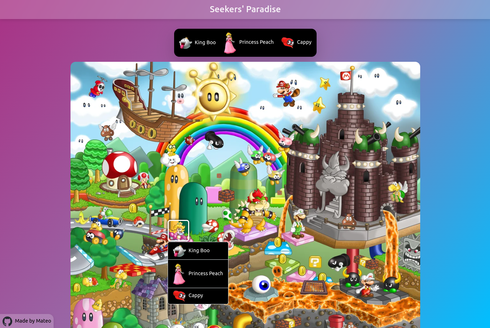

# Seekers' Paradise

A photo-tagging game built with <b>React (Vite)</b> on the frontend and <b>Express.js</b> on the backend. Users are presented with an image and characters to find, after the user finds all characters, they can save their record along with their name to the high scores table that is shown on the home page.

## Table of contents

- [Preview](#preview)
- [Getting Started](#getting-started)
- [Frontend Setup](#frontend-setup)
- [Backend Setup](#backend-setup)
- [Environment Variables](#environment-variables)
- [Running the Application](#running-the-application)

## Preview



## Getting Started

Ensure you have the following installed:

- Node.js (Latest LTS recommended)
- npm or yarn

Clone the repository:

```
git clone https://github.com/mateoo04/seekers-paradise.git
cd seekers-paradise
```

## Frontend Setup

Navigate to the client folder and install dependencies:

```
cd client
npm install  # or yarn install
```

To start the frontend development server:

```
npm run dev  # or yarn dev
```

This will start the Vite development server at http://localhost:5173/ (default).

## Backend Setup

Navigate to the server folder and install dependencies:

```
cd ../server
npm install  # or yarn install
npx prisma generate
npx prisma migrate dev
npx prisma db seed
```

To start the backend server:

```
npm run dev  # or yarn dev
```

By default, the Express server runs at http://localhost:4000/.

## Environment Variables

Create a .env file in the server directory and define the necessary variables:

```
DATABASE_URL=your_database_url
SECRET=your_secret
```

For the frontend, create a .env file in the client directory:

```
VITE_API_BASE_URL=api_url # should include /api at the end
```

## Running the Application

After setting up both frontend and backend, open two terminals and run:

1. Frontend: `npm run dev` in client/

2. Backend: `node app.js` in server/
